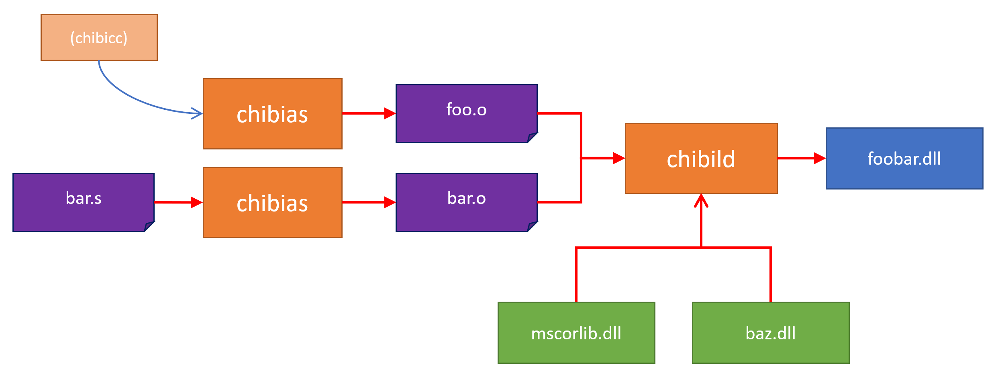

# The specialized backend toolchain for chibicc-cil

[](https://www.repostatus.org/#wip)

## NuGet

### .NET CLI interface

| Package     | NuGet                                                                                                                            |
|:------------|:---------------------------------------------------------------------------------------------------------------------------------|
| chibiar-cli | [](https://www.nuget.org/packages/chibiar-cli)    |
| chibias-cli | [](https://www.nuget.org/packages/chibias-cli)    |
| chibild-cli | [](https://www.nuget.org/packages/chibild-cli)    |

### Core libraries

| Package                  | NuGet                                                                                                                            |
|:-------------------------|:---------------------------------------------------------------------------------------------------------------------------------|
| chibiar.core             | [](https://www.nuget.org/packages/chibiar.core) |
| chibias.core             | [](https://www.nuget.org/packages/chibias.core) |
| chibild.core             | [](https://www.nuget.org/packages/chibild.core) |
| chibicc.toolchain.common | [](https://www.nuget.org/packages/chibicc.toolchain.common) |

[](https://github.com/kekyo/chibicc-cil-toolchain/blob/main/README.ja.md)

## What is this?

chibicc-toolchain is a toolchain, including a CIL/MSIL assembler and a linker,
that serves as a backend for porting [chibicc](https://github.com/rui314/chibicc) on .NET CIL/CLR.
The CIL assembler used in this toolchain can write CIL assembly language with simple syntax rules, perform assembly, and output .
Here is an example code:

```
.function public void() main
    ldstr "Hello world"
    call void(string) System.Console.WriteLine
    ret
```

On the surface, this toolchain can be regarded as just another CIL assembler variant.
.NET standard ILAsm is an exhaustive and primitive toolchain as a CIL assembler.
On the other hand, chibicc-toolchain differs in that it includes several important features
to improve interoperability with the C language.

It is WIP and broadcasting side-by-side Git commit portion on [YouTube (In Japanese)](https://bit.ly/3XbqPSQ).

[chibicc-cil](https://github.com/kekyo/chibicc-cil) will be made available as the porting progresses to some extent, please wait.


----

## Overview

chibicc-toolchain consists of the following toolchain programs:

* chibias: A CIL assembler.
* chibild: A CIL object linker.



chibias outputs the CIL source code ('*.s') almost as is as an object file ('*.o'),
and chibild performs the actual assembly process of the CIL source code.
Therefore, chibias does not perform syntax checking.

The strange behavior of chibias and chibild is due to implementation limitations.
For toolchain users, the advantage is that they can contrast their usage with
that of the "as" and "ld" toolchains expected on POSIX.

In the following sections, the CIL assembly source code is used directly in chibild.

### CIL assembling

chibild takes multiple CIL object file (source codes) as input, performs assembly,
and outputs the result as .NET assemblies.
At this time, reference assemblies can be specified so that they can be referenced from the CIL object file.

chibild was developed as a backend assembler for chibicc, but can also be used by us.
The source code employs simplified syntax rules compared to ILAsm,
making it easier to machine generation and easier for humans to write.


----

## How to use

Install CLI via nuget:

* chibias: [chibias-cli](https://www.nuget.org/packages/chibias-cli)
* chibild: [chibild-cli](https://www.nuget.org/packages/chibild-cli).

* (It is not `chibias-cil` and `chibild-cil` :)

```bash
$ dotnet tool install -g chibias-cli
$ dotnet tool install -g chibild-cli
```

Then:

```bash
$ cil-ecma-chibild

cil-ecma-chibild [0.63.0,net6.0] [...]
This is the CIL object linker, part of chibicc-cil project.
https://github.com/kekyo/chibicc-cil-toolchain
Copyright (c) Kouji Matsui
License under MIT

usage: cil-ecma-chibild [options] <input path> [<input path> ...]
  -o <path>         Output assembly path
  -shared, -mdll    Produce dll assembly
           -mexe    Produce executable assembly (defaulted)
           -mwinexe Produce Windows executable assembly
  -L <path>         Reference assembly base path
  -l <name>         Reference assembly name
  -i <path>         Will inject into an assembly file
  -g, -g2           Produce embedded debug symbol (defaulted)
      -g1           Produce portable debug symbol file
      -gm           Produce mono debug symbol file
      -gw           Produce windows proprietary debug symbol file
  -s, -g0           Omit debug symbol file
  -O, -O1           Apply optimization
      -O0           Disable optimization (defaulted)
  -x                Will not copy required assemblies
  -d <path>         CABI startup object directory path
  -e <symbol>       Entry point symbol (defaulted: _start)
  -v <version>      Apply assembly version (defaulted: 1.0.0.0)
  -m <tfm>          Target framework moniker (defaulted: net6.0)
  -m <arch>         Target Windows architecture [AnyCPU|Preferred32Bit|X86|X64|IA64|ARM|ARMv7|ARM64] (defaulted: AnyCPU)
  -m <rollforward>  CoreCLR rollforward configuration [Major|Minor|Feature|Patch|LatestMajor|LatestMinor|LatestFeature|LatestPatch|Disable|Default|Omit] (defaulted: Major)
  -a <path>         CoreCLR AppHost template path
      --log <level> Log level [debug|trace|information|warning|error|silent] (defaulted: warning)
      --dryrun      Need to dryrun
  -h, --help        Show this help
```

* The actual command name for chibild is `cil-ecma-chibild`, as are chibiar and chibias.
  This naming convention is analogous to GNU binutils.
* chibild assembles multiple input files (objects '*.o' and CIL sources '*.s')
  pointed out on the command line into a single .NET assembly.
* The reference library name `-l` is evaluated from the beginning, including the archive file path ('*.a').
  This feature applies to duplicated symbols (function/global variables).
  Library file names are assumed to be prefixed with `lib` as in the native toolchain,
  and also assumes the filename as specified in fallbacks.
* The default target framework moniker (`net6.0` in the above example) depends on the operating environment of chibild.
* Specifying a target framework moniker only assumes a variation of the core library.
  And it does NOT automatically detect the `mscorlib.dll` or `System.Private.CoreLib.dll` assembly files (see below).
* Target windows architecture is `AnyCPU` by default. These values ignore case.
  This value only sets the mark on the assembly. Specifying a different value will not affect generated your opcodes.
  It may always operate as `AnyCPU` except in Windows CLR environment.
* Log level is `warning` by default. These values ignore case.
* When using the `-i` injection mode, the `-a`, `-v` and `-m` specifications are ignored.
* chibild has the ability to automatically copy referenced assemblies except for system assemblies
  (such as `mscorlib.dll` and `System.Private.CoreLib.dll`), but if `-x` is specified, it will not automatically copy.
  Note that this feature is simplified and may not copy all necessary files.
  If you are planning a complex deployment, it is likely that you will need to build with MSBuild.


----

## Hello world

Let's play "Hello world" with chibild.
You should create a new source code file `hello.s` with the contents only need 4 lines:

```
.function public void() _start
    ldstr "Hello world with chibild!"
    call void(string) System.Console.WriteLine
    ret
```

Then invoke chibild with:

```bash
$ cil-ecma-chibild -mnet45 -L/mnt/c/Windows/Microsoft.NET/Framework64/v4.0.30319 -lmscorlib -o hello.exe hello.s
```

Run it:

```bash
$ ./hello.exe
Hello world with chibild!
```

Yes, this example uses the `System.Console.WriteLine()` defined in the `mscorlib.dll` assembly file in the
Windows environment (WSL). But now you know how to reference assemblies from chibild.

Linux and other operating systems can be used in the same way, by adding references you need.
Also, if you assemble code that uses only built-in types (see below), you do not need references to other assemblies:

```
.function public int32() _start
    ldc.i4.1
    ldc.i4.2
    add
    ret
```

```bash
$ cil-ecma-chibild -mnet45 -o adder.exe adder.s
$ ./adder.exe
$ echo $?
3
```

* Note: In this example, some warnings about attributes is generated during assembly.
  Which can be ignored.
* If you use arguments equivalent to `argc` or `argv` in the `main` function,
  you need to specify the startup code (`crt0.o`) and a reference to the `mscorlib.dll` assembly, which is the FCL.

### To run with .NET Core and others

Specify the target framework moniker and make sure that the reference assembly `System.Private.CoreLib.dll`:

```bash
$ cil-ecma-chibild -mnet6.0 -L$HOME/.dotnet/shared/Microsoft.NETCore.App/6.0.13 -lSystem.Private.CoreLib \
  -o hello.exe hello.s
```

The version of the target framework moniker and the corresponding core library must match.
If you specify `net6.0` and use the .NET Core 2.2 core library, you will get a warning.

Note: Minor target framework monikers are not currently supported.
For example, `uap10.0`, `tizen1` and `portable+net45+wp5+sl5`.
This is because the standard target framework moniker parser is not included in the BCL.

### FYI: How do I get the core assembly files?

If you want to obtain `mscorlib.dll` legally,
you can use the [ReferenceAssemblies (net45)](https://www.nuget.org/packages/microsoft.netframework.referenceassemblies.net45) package.

This package is provided by MS under the MIT license, so you are free to use it.
The `nupkg` file is in zip format, so you can use `unzip` to extract the contents.

It is important to note that all of the assemblies included in this package do not have any code bodies.
It is possible to reference them with chibild, but it is not possible to run them.
If you want to run it in a Linux environment or others, you will need a runtime such as mono/.NET Core.

```bash
$ mono ./hello.exe
Hello world with chibild!
```

In any case, if you want to refer to the complete `mscorlib.dll` or `System.Private.CoreLib.dll` files,
it may be better to simply install mono and/or .NET SDK and reference the files in that directory.

At the moment, chibild does not automatically detect these assembly files installed on the system.
This is by design as stand-alone independent assembler, like the GNU assembler.
In the future, it may be possible to resolve assembly files automatically via the MSBuild script.

(The `chibicc.build` package is available for this purpose. But it is still incomplete and cannot be used now.)


----

## Assembly syntax

TODO: WIP, Specifications have not yet been finalized.

To check the syntax, you should look at [the test code](https://github.com/kekyo/chibicc-cil-toolchain/blob/main/chibild.core.Tests/AssemblerTests.cs).

The syntax of chibild has the following features:

* The body of the opcode can be written in almost the same way as in ILAsm.
* Unnecessarily verbose descriptions are eliminated as much as possible.
* Codes related to OOP cannot be written or have restrictions

It is basically designed to achieve a "C language" like chibicc,
but it should be much easier to write than ILAsm.

### Minimum, included only main entry point

```
.function public int32() _start
    ldc.i4 123    ; This is comment.
    ret
```

* Source code decoding with UTF-8.
* The line both pre-whitespaces and post-whitespaces are ignored.
  * That is, indentation is simply ignored.
* The semicolon (';') starts comment, ignores all words at end of line.
* Begin a word with dot ('.') declaration is "Assembler directives."
  * The `.function` directive means the start of a function.
    It is followed by operands in the following order:
    * Scope descriptor
    * Function signature descriptor
    * Function name
  * The function body continues until the next function directive appears.

Scope descriptors are common in other declarations.

| Scope descriptor | Description |
|:----|:----|
| `public` | Can be referenced from any scope and any external assemblies. |
| `internal` | Referenced only within the same assembly. |
| `file` | Referenced only from the current source code file. |

* Automatic apply entry point when using `_start` function name and assemble executable file with same as `-mexe` option.
* Specify `-efoo` to change the symbol of the entry point to `foo`.

The signature of the entry point follows the requirements of the CLR.
That is, the following combinations are possible:

|Function signature|Example signature in the C# language|
|:----|:----|
|`void()`|`static void _start()`|
|`int32()`|`static int32 _start()`|
|`void(args:string[])`|`static void _start(string[] args)`|
|`int32(args:string[])`|`static int32 _start(string[] args)`|

* For function signatures, see the description below.

#### Supplemental: Startup code

When using chibicc, the entry point is assumed to be defined only as the C language `main` function.
For example, `int main(int argc, char **argv)`.

The difference is achieved by chibicc supplying an object file such as `crt0.o`
containing the startup code and generating the arguments required by the C language in it.
(A special `-d` option exists for this purpose.)

In this document, startup codes are omitted from the explanation.
Therefore, the startup code rules always follow the table above.

### Literals

```
.function public int32() _start
    ldc.i4 123
    ldc.r8 1.234
    ldstr "abc\"def\"ghi"
    pop
    pop
    ret
```

* Numeric literal formats are compatible with .NET Format provider.
  * Integer literal: `System.Int32.Parse()` and suitable types with `InvariantCulture`.
  * Floating point number literal: `System.Double.Parse()` and suitable types with `InvariantCulture`.
* String literal is double-quoted ('"').
  * Escape character is ('\\'), same as C language specification except trigraph chars.
  * Hex number ('\\xnn') and UTF-16 ('\\unnnn') numbers are acceptable.

### Labels

```
.function public int32() _start
    ldc.i4 123
    br NAME
    nop
NAME:
    ret
```

Label name ends with (':').
Label name requires unique in the function scope.

### The type names

Type names can be both built-in types and .NET.
.NET type names are always specified as fully qualified names with namespaces.
For example, in the form `System.String`.

The built-in type is as follows:

|Build-in type|Exact type|Alias type names|
|:----|:----|:----|
|`void`|`System.Void`| |
|`uint8`|`System.Byte`|`byte`|
|`int8`|`System.SByte`|`sbyte`|
|`int16`|`System.Int16`|`short`|
|`uint16`|`System.UInt16`|`ushort`|
|`int32`|`System.Int32`|`int`|
|`uint32`|`System.UInt32`|`uint`|
|`int64`|`System.Int64`|`long`|
|`uint64`|`System.UInt64`|`ulong`|
|`float32`|`System.Single`|`float`, `single`|
|`float64`|`System.Double`|`double`|
|`nint`|`System.IntPtr`|`intptr`|
|`nuint`|`System.UIntPtr`|`uintptr`|
|`bool`|`System.Boolean`| |
|`char`|`System.Char`|`char16`|
|`object`|`System.Object`| |
|`string`|`System.String`| |
|`typedref`|`System.TypedReference`| |

Among the built-in types, the `System.Boolean` and `System.Char` types are special,
and when we use these types, they always apply 1-byte or 2-byte marshalling.
.NET default, although the footprint size of these types can depending on the situation.
It means that assemblies generated will always be the above size.

The function pointer type is specified as follows:
(Separated with white space is not allowed.)

```
string(int8,int32)*
```

Pseudo code in C#:

```csharp
// Static method example.
static string foo(sbyte a, int b)

// Function delegate example.
unsafe delegate*<sbyte, int, string>
```

It can also represent variadic function pointer types marked `...`:

```
string(int8,int32,...)*
```

You can combine array/pointer/refernces(managed pointer).

* `int32[]`
* `int32[][]`
* `int32[4]`
* `int32[4][3]`
* `int32*`
* `int32**`
* `int32&`
* `string(int32&,int8)*[42]`
* `int(sbyte*)*(string,int8)*`

A type that specifies the number of elements in an array is called a "Value array type."

"Function pointer types", "Variable arguments", and "Value array types" are treated differently from
"Delegate types", "Variable arguments marked `params`" and "Arrays derived from `System.Array`" in C#.

See separate section for details.

### Local variables

```
.function public int32() _start
    .local int32
    .local int32 abc
    ldc.i4 1
    stloc 0
    ldc.i4 2
    stloc 1
    ret
```

We can declare local variables with `.local` directive inside function body.
The local directive could have optional variable name.

We can refer with variable name in operand:

```
.function public void foo
    .local int32 abc
    ldc.i4 1
    stloc abc
    ret
```

If the local variable is a reference (managed pointer), it is automatically marked as `pinned`.
This allows the use of a scratch buffer when dealing with raw pointer to a value type:

```
.function public int32() foo
    .local int32& buf    ; <-- pinned
    .local int32* p
    ldsflda gv
    stloc.0
    ldloc.0
    conv.u
    stloc.1
    ldloc.1
    ldind.i4
    ret
.global int32 gv
```

### Call another function

```
.function public int32() _start
    ldc.i4 1
    ldc.i4 2
    call add2
    ret
.function public int32(x:int32,y:int32) add2 
    ldarg 0
    ldarg y   ; We can refer by parameter name
    add
    ret
```

The parameters for function signature are optional. Formats are:

* `int32`: Only type name.
* `x:int32`: Type name with parameter name.

The function name both forward and backaward references are accepted.

Important: If you are calling a function defined in chibild,
you do not need to specify any parameter type list for the `call` operand.
In another hand, .NET overloaded methods, an parameter type list is required.

Function accepts additional variable arguments:

```
.function public int32(a1:int32,...) addn
    .local System.ArgIterator
    ldloca.s 0
    arglist
    call void(System.RuntimeArgumentHandle) System.ArgIterator..ctor
    ; (Iterates with ArgIterator.)
    ret
```

A trailing `...` at the end of the argument list of the function signature to mark it as accepting variable arguments.

However, that this variable parameter is handled differently from variable parameters (.NET array) in C#.
chibild uses `arglist` semantics in defined CIL.

`arglist` is enumerated using the `System.ArgIterator` type, as in the example above.
For more information, you need to Google the `__arglist` keyword or `ArgIterator` in C#.

Calls to functions with variable parameters require an explicit list of parameter types.
For example, calls above function `add_n` would use:

```
.function public int32() _start
    ldc.i4.s 123
    ldc.r8 123.456    ; <-- Additional parameter
    ldstr "ABC"       ; <-- Additional parameter
    call int32(int32,float64,string) add_n
    ret
```

All types of parameters to be passed in a function call, including types corresponding to additional arguments,
are made explicit as signatures.

Because chibild does not perform flow analysis to detect parameter types automatically.
If this declaration is incorrect, calls will fail at runtime.

### Call external function

Before assemble to make `test.dll`

```
.function public int32(a:int32,b:int32) add2
    ldarg 0
    ldarg 1
    add
    ret
```

```bash
$ chibild -c test.s
```

Then:

```
.function public int32() _start
    ldc.i4 1
    ldc.i4 2
    call add2
    ret
```

```bash
$ chibild -ltest main.s
```

The functions (.NET CIL methods) are placed into single class named `C.text`.
That mapping is:

* `int32() _start` --> `public static int32 C.text::main()`
* `int32(a:int32,b:int32) add2` --> `public static int32 C.text::add2(int32 a, int32 b)`

Pseudo code in C# (test.dll):

```csharp
namespace C;

public static class text
{
    public static int add2(int a, int b) => a + b;
}
```

Pseudo code in C# (main.exe):

```csharp
extern alias test;
using test_text = test::C.text;

namespace C;

public static class text
{
    public static int main() => test_text::add2(1, 2);
}
```

This is named "CABI (chibicc application binary interface) specification."

CABI only applies if the function can be referenced from an external assembly.
If the scope of the function is not `public`,
it cannot be referenced from external assemblies and is not CABI compliant.

### Call external .NET method

Specify the method signature and full method name:

```
.function public void() main
    ldstr "Hello world"
    call void(string) System.Console.WriteLine
    ret
```

You must specify a .NET method that is `public` scope, and you cannot specify a method with generic parameters.
You can also specify an instance method, but the first argument of the method signature will not be of type `this`.
Naturally, a reference to `this` must be pushed onto the evaluation stack.

A list of parameter types is used to identify overloads.
If no signature is specified and there are multiple overload methods, the wrong method may be selected.
Generally, the return type is not verified,

You have to give it containing assembly on command line option `-l`.
This is true even for the most standard `mscorlib.dll` or `System.Runtime.dll`.

Tip: If you need to call properties or indexers,
you must specify the signatures of the methods that implement them. For example:

```
    ldstr "ABCDE"
    call System.String.get_Length   ; "ABCDE".Length
```

Most properties use a fixed naming convention.
As above, in the case of `System.String.Length` corresponds to the method names `get_Length()`
for getter and `set_Length()` for setter.
In the case of an indexer, it corresponds to the method name `get_Item()` or `set_Item()`.

However, these naming conventions are not mandatory, so different names may apply.
If this does not work, please use tools such as ILDAsm or ILSpy to check target signature.

### Function signature syntax

Function signature is a syntax that indicates the parameter set and return type of the method being called.
Sometimes referred to as "Call sites" in .NET.
In the case of chibild, they are specified with a syntax similar to function pointer types.

Function signatures differ from function pointer types in that they are not terminated
with a `*` because they are not pointers.

* `int32(string)*`: Function pointer
* `int32(string)`: Function signature (call site)

These are used in function directives, to identify method overloads in the `call` and `ldftn` opcodes,
and in the `calli` opcode:

```
.function public int32() _start
    ldstr "123"
    ldftn int32(string) System.Int32.Parse
    calli int32(string)
    ret
```

### Global variables

Global variable format is same as local variable format plus scope descriptor.
However, excludes declarations outside function body:

```
.function public int32() _start
    ldc.i4 123
    stsfld foo
    ldsfld foo
    ret
.global public int32 foo
```

The global variable name both forward and backaward references are accepted.

If the global variable is `public`, it is placed in the `C.data` class according to CABI.

Pseudo code in C#:

```csharp
namespace C;

public static class data
{
    public static int foo;
}

public static class text
{
    public static int main()
    {
        data.foo = 123;
        return data.foo;
    }
}
```

### Initializing data

The global variable declares with initializing data:

```
.function public int32() bar
    ldsfld foo
    ret
; int32 foo = 0x76543210
.global internal int32 foo 0x10 0x32 0x54 0x76
```

The data must be fill in bytes.

If initialization data is included,
an attempt to write a value to that memory area may result in an `AccessViolationException`.

### Initializer

An initializer is a function that is executed just before manipulating global variables in an assembly.
Internally, it is called from .NET type initializer.
It can be used mainly for complex initialization of global variables:

```
.initializer internal
    ldc.i4 123
    stsfld foo
    ret
.global public int32 foo
```

The scope descriptor is considered the same as `internal` even if it is specified as `public`.
It is not only definition the scope, but also determines when the initialization is performed:

* `public` or `internal`: Called just before manipulating global variables
  whose scope is specified as `public` or `internal`.
* `file`: Called just before manipulating global variables whose scope is specified as `file`.

### Value array type

.NET does not have an array type that behaves like a value type.
chibild can use the `value array` type to pseudo-realize this.
The value array type plays a very important role in the realization of the C language compiler.

To use a value array type, declare the type as follows:

```
.function public int8[5]() bar   ; <-- Value array requres element length
    ldsfld foo
    ret
.global internal int8[5] foo 0x10 0x32 0x54 0x76 0x98
```

At this time, the actual type of the `bar` function and the `foo` variable will be of type `System.SByte_len5`.
Specifically, the following structure is declared automatically.

Pseudo code in C#:

```csharp
namespace System;

[StructLayout(LayoutKind.Sequential)]
public struct SByte_len5   // TODO: : IList<sbyte>, IReadOnlyList<sbyte>
{
    private sbyte item0;
    private sbyte item1;
    private sbyte item2;
    private sbyte item3;
    private sbyte item4;

    public int Length => 5;
    public sbyte this[int index]
    {
        get => /* ... */;
        set => /* ... */;
    }
}
```

This structure can behave likes an array outside of chibild (and chibicc).

The natural interpretation of composite types is also performed.
For example:

* `int8[5]*` --> `System.SByte_len5*`
* `int8*[5]` --> `System.SByte_ptr_len5`
* `int8[5][3]` --> `System.SByte_len5_len3`
* `int8[5]*[3]` --> `System.SByte_len5_ptr_len3`

When declaring nested array types, care must be taken with the order of the elements.
For example, order in chibild is reversed for a type expressed in C as follows:

```c
// C language
char foo[3][4][5];

// chibild
int8[5][4][3] foo
```

This is because chibild evaluate array types from the left to right, as follows.
The composite type definitions described above are same:

`( ( int8 [5] ) [4] ) [3]`

Note: To use the value array type, references to the types `System.ValueType`
and `System.IndexOutOfRangeException` must be resolved.
Add a reference to `mscorlib.dll` or `System.Private.CoreLib.dll`.

### Enumeration type

The enumeration type that can be defined in chibild are the same as enumeration type in .NET,
which implicitly inherit from `System.Enum`.

```
.enumeration public int32 foo
    beef
    pork
    chicken
```

Pseudo code in C#:

```csharp
namespace C.type;

public enum foo : int
{
    beef,
    pork,
    chicken
}
```

By default, values assigned to enumeration values are incremented sequentially from 0.
To specify explicitly:

```
.enumeration public int32 foo
    beef 5
    pork 13
    chicken 42
```

Enumeration type allow you to explicitly specify underlying type of the source value:

```
.enumeration public int64 foo   ; Value as underlying int64
    beef 5
    pork 13
    chicken 42
```

Only the following types can be specified as underlying types:

* `int8`, `uint8`
* `int16`, `uint16`
* `int32`, `uint32`
* `int64`, `uint64`

Note: To use an enumerated type, a reference to the `System.Enum` type must be resolved.
Add a reference to `mscorlib.dll` or `System.Private.CoreLib.dll`.

### Structure type

The structure types that can be defined in chibild are the same as structure types in .NET,
which implicitly inherit from `System.ValueType`.

```
.structure public foo
    public int32 a
    internal int8 b
    public int32 c
```

Pseudo code in C#:

```csharp
namespace C.type;

[StructLayout(LayoutKind.Sequential)]
public struct foo
{
    public int a;
    internal sbyte b;
    public int c;
}
```

Each member of the structure can have a scope descriptor.
However, only `public` and `internal` can be specified.

By default, structure packing is left to the CLR.
To specify explicitly:

```
.structure public foo 4  ; pack=4
    public int32 a
    public int8 b
    public int32 c
```

Or gives an offset to each member:

```
.structure public foo explicit
    public int32 a 0     ; offset=0
    public int8 b 4      ; offset=4
    public int32 c 5     ; offset=5
```

By arbitrarily adjusting the offset, we can reproduce the union type in the C language.

The last member of the structure type can be a value array type with unspecified number of elements:

```
.structure public foo
    public int32 a
    public int8 b
    public int32[*] c
```

If you specify the number of array elements as `*`,
that does not specify the number of elements (called flex array.)
It is a special type for indexer accesses are not checked for element counts out of range.
Naturally, the result of accessing an out of element will be undefined, so care must be taken.

Although the flex array type is intended to be used for the last member of the structure type,
chibild does not perform this check.

Note: To use an structure type, a reference to the `System.ValueType` type must be resolved.
Add a reference to `mscorlib.dll` or `System.Private.CoreLib.dll`.

### About duplicate symbols

When chibild searches for any type, global variable,
or function (referred to as members),
it performs the search as follows:

1. Refer to a member when find the `file` scope defined in the same object file.
2. Refer to a member when find the `public` or `internal` scope defined in any inputs.
   In this case, search priority is the order of the input groups
   (object files, archive files and assembly files) specified in the command line options.
3. An error occurs because it is not found.

Symbol names are searched according to their respective member types.
Even if the symbol name is the same, the type, global variable,
and function are treated separately.

### Explicitly location information

The file and location directive will emit sequence points into debugging information.
Sequence points are used to locate where the code being executed corresponds to in the source code.
In other words, when this information is given,
the debugger will be able to indicate the location of the code being executed in the source code.

This information is optional and does not affect assembly task if it is not present.

```
.file 1 "/home/kouji/Projects/test.c" c
.function public int32() _start
    .location 1 10 5 10 36
    ldc.i4 123
    ldc.i4 456
    add
    .location 1 11 5 11 32
    ldc.i4 789
    sub
    ret
```

* The file directive maps ID to source code file.
  * First operand: ID (Valid any symbols include number, same as GNU assembler's `.fil` directive).
  * Second operand: File path (or source code identity) string.
  * Third operand: Language indicator, see listing below. (Optional)
  * The file directive can always declare, and will overwrite same ID.
* The location directive indicates source code location.
  * First operand: ID for referring source code file.
  * Second operand: Start line index. (0 based index)
  * Third operand: Start column index. (0 based index)
  * Forth operand: End line index. (0 based index)
  * Fifth operand: End column index. (0 based index, must larger than start)
  * The location directive can declare only in the function body.
  * Applies only to an opcode immediately after the location directive is specified.

The language indicators is shown (not all):

|Language indicator|Language|
|:----|:----|
|`cil`|CIL|
|`c`|C|
|`cpp`|C++|
|`csharp`|C#|
|`fsharp`|F#|
|`other`|-|

Language indicator comes from [Mono.Cecil.Cil.DocumentLanguage](https://github.com/jbevain/cecil/blob/7b8ee049a151204997eecf587c69acc2f67c8405/Mono.Cecil.Cil/Document.cs#L27).

Will produce debugging information with CIL source file itself when does not apply any location directive.
But use the `.hidden` directive to prevent subsequent code from generating sequence points:

```
.function public int32() _start
    .hidden
    ldc.i4 123     ; <-- Sequence points are not emit below.
    ldc.i4 456
    add
    ret
```

If you specify a `.location` directive that specifies a valid ID, sequence points will be emit.


----

## Injection mode

The injection mode is one of the distinctive features of chibild,
to embed CIL code directly in a pre-prepared .NET assembly file.
This mode is enabled by specifying `-i` command line option.

For example, if you have a .NET assembly `managed.dll` compiled in C#.
Using the injection mode, you can embed the resulting .NET assembly CIL code directly in `managed.dll`.

Suppose there is a `managed.dll` assembly generated from the following C# source:

```csharp
namespace C;

// Place methods in the C.text class so that they can be recognized from the CIL code side
public static class text
{
    public static long add_int64(long a, long b) =>
        a + b;
}
```

Using injection mode, you can "inject" the following CIL code directly into `managed.dll` and link it correctly with `add_int64` method:

```
.function public int32() add_c
    ldc.i4.1
    conv.i8
    ldc.i4.2
    conv.i8
    call add_int64    ; Calling methods on the C# side
    conv.i4
    ret
```

To `injected.dll` by the command:

```bash
$ cil-ecma-chibild -mnet6.0 -L$HOME/.dotnet/shared/Microsoft.NETCore.App/6.0.13 -lSystem.Private.CoreLib \
  -i managed.dll -c -o injected.dll add_c.s
```

This means that generated from C code by chibicc,
can be directly merged with C# source code to generate a single .NET interoperable assembly file.

In the current version, it is possible to reference symbols in the injected .NET assembly from the CIL source code.

* In a future version, it will be possible to reference CIL function symbols from .NET assemblies.


----

## Building the toolchains from source code

Builds can be done in .NET 8 SDK environment.
There are no prerequisites required for the build.
For example:

```bash
$ dotnet build chibicc-cil-toolchain.sln
```

The test currently relies on the native binary ILDAsm, so they can only be run on Windows x64 or Linux x64.
In my environment, it takes about 30 seconds.

```bash
$ dotnet test chibicc-cil-toolchain.sln
```

The `build-nupkg.bat` or `build-nupkg.sh` will generate NuGet packages in the `artifacts` directory.
The `chibias.net4` and `chibild.net4` project generates single file binaries for `net48` in `Release` build.


----

## TODO

Might be implemented:

* Automatic implements `IList<T>` on value array type.
* Handling method optional attributes (inline, no-inline and no-optimizing?)
* And chibicc-cil specific requirements...

Might not be implemented:

* `OperandType`
  * InlineSwitch
  * InlinePhi
* Handling multi-dimensional array types.
* Handling OOP-based features.
* Exception handling.
* Strong name signer.
* And NOT chibicc-cil specific requirements.


----

## chibicc-toolchain background

Initially I used [ILAsm.Managed](https://github.com/kekyo/ILAsm.Managed), but there were some issues:

* Resolving assembly references:
  ILAsm requires explicitly qualifying the assembly name when referring to a member defined in an external assembly,
  but this is not easy to resolve in internal compiler.
* Calculation of `.maxstack`:
  To measure the overall consumption of the evaluation stack, the execution flow must be analyzed in internal compiler.
* Debugging information:
  ILAsm can provide debugging information, but it also has the following problems:
  * Debugging information from CIL source code itself, but it is not possible to create references to the original source code.
    This corresponds to `.fil` and `.loc` directives in GNU assembler.
    Also, there was a possibility to provide richer debugging information in .NET assembly,
    but it is not possible as far as using ILAsm.
  * Managed debugging information is in "MDB" format, which is not suitable for the current situation.
    So it is necessary to be able to realize "Portable PDB" or "Embedded."
    This could be solved by using the ILAsm provided by MS, but we have decided not to use it because of [another problem](https://github.com/kekyo/ILAsm.Managed#background).
* ILAsm has complex and redundant syntax rules.
  * Want to eliminate excessive curly-brace syntax. ('{ ... }')
  * Want to eliminate unusual optional member attributes.
  * Want to eliminate excessive namespace/type member prefixes.

These were considered difficult to work around and led us to implement our own assembler with the minimum required functionality.

I am implementing this in parallel with the porting of chibicc-cil, adding and changing features that we have newly discovered. For example:

* Added value array type feature.
* Combined initializer into global variables.
* Definition of CABI

----

## License

Under MIT.
