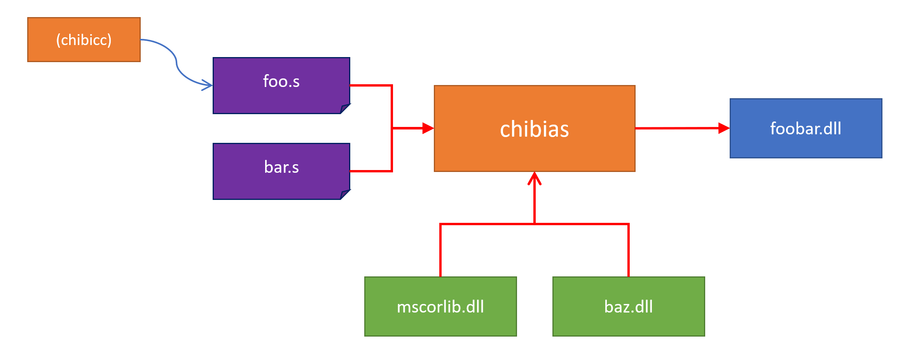

# The specialized backend CIL assembler for chibicc-cil

[](https://www.repostatus.org/#wip)

## NuGet

| Package  | NuGet                                                                                                                |
|:---------|:---------------------------------------------------------------------------------------------------------------------|
| chibias-cli (dotnet CLI) | [](https://www.nuget.org/packages/chibias-cli) |
| chibias.core (Core library) | [](https://www.nuget.org/packages/chibias.core) |
| chibias.build (MSBuild scripting) | [](https://www.nuget.org/packages/chibias.build) |

## What is this?

[](https://github.com/kekyo/chibias-cil/blob/main/README.ja.md)

This is a CIL/MSIL assembler, backend for porting C language compiler implementation derived from [chibicc](https://github.com/rui314/chibicc) on .NET CIL/CLR.
It is WIP and broadcasting side-by-side Git commit portion on [YouTube (In Japanese)](https://bit.ly/3XbqPSQ).

[chibicc-cil](https://github.com/kekyo/chibicc-cil) will be made available as the porting progresses to some extent, please wait.


----

## Overview

chibias takes multiple CIL source codes as input, performs assembly, and outputs the result as . NET assemblies. At this time, reference assemblies can be specified so that they can be referenced from the CIL source code.



chibias was developed as a backend assembler for chibicc, but can also be used by us.
The source code employs simplified syntax rules compared to ILAsm,
making it easier to machine generation and easier for humans to write.

The general C compiler generates intermediate object format files `*.o` by inputting them to the linker `ld` at the final stage. chibias does not handle such object files, but generates `exe` and `dll` directly. When dealing with split source code, you can consider the source code itself (`*.s`) as an intermediate object format file and treat it same way as a linker.


----

## How to use

Install CLI via nuget package [chibias-cli](https://www.nuget.org/packages/chibias-cli). (NOT 'chibias-cil' :)

```bash
$ dotnet tool install -g chibias-cli
```

Then:

```bash
$ chibias

chibias [0.18.0,net6.0] [...]
This is the CIL assembler, part of chibicc-cil project.
https://github.com/kekyo/chibias-cil
Copyright (c) Kouji Matsui
License under MIT

usage: chibias [options] <source path> [<source path> ...]
  -o <path>         Output assembly path
  -c, --dll         Produce dll assembly
      --exe         Produce executable assembly (defaulted)
      --winexe      Produce Windows executable assembly
  -r <path>         Reference assembly path
  -g, -g2           Produce embedded debug symbol (defaulted)
      -g1           Produce portable debug symbol file
      -gm           Produce mono debug symbol file
      -gw           Produce windows proprietary debug symbol file
      -g0           Omit debug symbol file
  -O, -O1           Apply optimization
      -O0           Disable optimization (defaulted)
  -s                Suppress runtime configuration file
  -v <version>      Apply assembly version (defaulted: 1.0.0.0)
  -f <tfm>          Target framework moniker (defaulted: net6.0)
      --log <level> Log level [debug|trace|information|warning|error|silent]
  -h, --help        Show this help
```

* chibias will combine multiple source code in command line pointed into one assembly.
* Reference assembly paths evaluates last-to-first order, same as `ld` looking up.
  This feature applies to duplicated symbols (function/global variables).
* The default target framework moniker (`net6.0` in the above example) depends on the operating environment of chibias.
* Specifying a target framework moniker only assumes a variation of the core library.
  And it does NOT automatically detect the `mscorlib.dll` or `System.Private.CoreLib.dll` assembly files (see below).


----

## Hello world

Let's play "Hello world" with chibias.
You should create a new source code file `hello.s` with the contents only need 4 lines:

```
.function public void main
    ldstr "Hello world with chibias!"
    call System.Console.WriteLine string
    ret
```

Then invoke chibias with:

```bash
$ chibias -f net45 -r /mnt/c/Windows/Microsoft.NET/Framework64/v4.0.30319/mscorlib.dll -o hello.exe hello.s
```

Run it:

```bash
$ ./hello.exe
Hello world with chibias!
```

Yes, this example uses the `System.Console.WriteLine()` defined in the `mscorlib.dll` assembly file in the
Windows environment (WSL). But now you know how to reference assemblies from chibias.

Linux and other operating systems can be used in the same way, by adding references you need.
Also, if you assemble code that uses only built-in types (see below), you do not need references to other assemblies:

```
.function public int32 main
    ldc.i4.1
    ldc.i4.2
    add
    ret
```

```bash
$ chibias -f net45 -o adder.exe adder.s
$ ./adder.exe
$ echo $?
3
```

### To run with .NET 6, .NET Core and others

Specify the target framework moniker and make sure that the reference assembly `System.Private.CoreLib.dll`:

```bash
$ chibias -f net6.0 -r ~/.dotnet/shared/Microsoft.NETCore.App/6.0.13/System.Private.CoreLib.dll -o hello.exe hello.s
```

The version of the target framework moniker and the corresponding core library must match.
If you specify `net6.0` and use the .NET Core 2.2 core library, you will get a warning.

Note: Minor target framework monikers are not currently supported.
For example, `uap10.0`, `tizen1` and `portable+net45+wp5+sl5`.
This is because the standard target framework moniker parser is not included in the BCL.

### FYI: How do I get the core assembly files?

If you want to obtain `mscorlib.dll` legally,
you can use the [ReferenceAssemblies (net45)](https://www.nuget.org/packages/microsoft.netframework.referenceassemblies.net45) package.

This package is provided by MS under the MIT license, so you are free to use it.
The `nupkg` file is in zip format, so you can use `unzip` to extract the contents.

It is important to note that all of the assemblies included in this package do not have any code bodies.
It is possible to reference them with chibias, but it is not possible to run them.
If you want to run it in a Linux environment or others, you will need a runtime such as mono/.NET Core.

```bash
$ mono ./hello.exe
Hello world with chibias!
```

In any case, if you want to refer to the complete `mscorlib.dll` or `System.Private.CoreLib.dll` files,
it may be better to simply install mono and/or .NET SDK and reference the files in that directory.

At the moment, chibias does not automatically detect these assembly files installed on the system.
This is by design as stand-alone independent assembler, like the GNU assembler.
In the future, it may be possible to resolve assembly files automatically via the MSBuild script.

(The `chibias.build` package is available for this purpose. But it is still incomplete and cannot be used now.)


----

## Assembly syntax

TODO: WIP, Specifications have not yet been finalized.

To check the syntax, you should look at [the test code](https://github.com/kekyo/chibias-cil/blob/main/chibias.core.Tests/AssemblerTests.cs).

The syntax of chibias has the following features:

* The body of the opcode can be written in almost the same way as in ILAsm.
* Unnecessarily verbose descriptions are eliminated as much as possible.
* Codes related to OOP cannot be written or have restrictions

It is basically designed to achieve a "C language" like chibicc,
but it should be much easier to write than ILAsm.

### Minimum, included only main entry point

```
.function public int32 main
    ldc.i4 123    ; This is comment.
    ret
```

* Source code decoding with UTF-8.
* The line both pre-whitespaces and post-whitespaces are ignored.
  * That is, indentation is simply ignored.
* The semicolon (';') starts comment, ignores all words at end of line.
* Begin a word with dot ('.') declaration is "Assembler directives."
  * The `.function` directive means the start of a function.
    It is followed by operands in the following order:
    * Scope descriptor
    * Return type name
    * Function name
    * Parameter type list (when required)
  * The function body continues until the next function directive appears.

Scope descriptors are common in other declarations.

| Scope descriptor | Description |
|:----|:----|
| `public` | Can be referenced from any scope and any external assemblies. |
| `internal` | Referenced only within the same assembly. |
| `file` | Referenced only from the current source code file. |

* Automatic apply entry point when using `main` function name and assemble executable file with same as `--exe` option.
  The entry point is acceptable any scope descriptor (ignored).

### Literals

```
.function public int32 main
    ldc.i4 123
    ldc.r8 1.234
    ldstr "abc\"def\"ghi"
    pop
    pop
    ret
```

* Numeric literal formats are compatible with .NET Format provider.
  * Integer literal: `System.Int32.Parse()` and suitable types with `InvariantCulture`.
  * Floating point number literal: `System.Double.Parse()` and suitable types with `InvariantCulture`.
* String literal is double-quoted ('"').
  * Escape character is ('\\'), same as C language specification except trigraph chars.
  * Hex number ('\\xnn') and UTF-16 ('\\unnnn') numbers are acceptable.

### Labels

```
.function public int32 main
    ldc.i4 123
    br NAME
    nop
NAME:
    ret
```

Label name ends with (':').
Label name requires unique in the function scope.

### The type names

Type names can be both built-in types and .NET.
.NET type names are always specified as fully qualified names with namespaces.
For example, in the form `System.String`.

The built-in type is as follows:

|Build-in type|Exact type|Alias type names|
|:----|:----|:----|
|`void`|`System.Void`| |
|`uint8`|`System.Byte`|`byte`|
|`int8`|`System.SByte`|`sbyte`|
|`int16`|`System.Int16`|`short`|
|`uint16`|`System.UInt16`|`ushort`|
|`int32`|`System.Int32`|`int`|
|`uint32`|`System.UInt32`|`uint`|
|`int64`|`System.Int64`|`long`|
|`uint64`|`System.UInt64`|`ulong`|
|`float32`|`System.Single`|`float`, `single`|
|`float64`|`System.Double`|`double`|
|`intptr`|`System.IntPtr`|`nint`|
|`uintptr`|`System.UIntPtr`|`nuint`|
|`bool`|`System.Boolean`| |
|`char`|`System.Char`|`char16`|
|`object`|`System.Object`| |
|`string`|`System.String`| |
|`typeref`|`System.TypedReference`| |

The function pointer type is specified as follows:
(Separated with white space is not allowed.)

```
string(int8,int32)*
```

Pseudo code in C#:

```csharp
// Static method example.
static string foo(sbyte a, int b)

// Function delegate example.
unsafe delegate*<sbyte, int, string>
```

It can also represent function pointer types with variable arguments marked `...`:

```
string(int8,int32,...)*
```

You can combine array/pointer/refernces.

* `int32[]`
* `int32[][]`
* `int32[4]`
* `int32[4][3]`
* `int32*`
* `int32**`
* `int32&`
* `string(int32&,int8)*[42]`

A type that specifies the number of elements in an array is called a "Value array type."

"Function pointer types", "Variable arguments", and "Value array types" are treated differently from
"Delegate types", "Variable arguments marked `params`" and "Arrays derived from `System.Array`" in C#.

See separate section for details.

### Local variables

```
.function public int32 main
    .local int32
    .local int32 abc
    ldc.i4 1
    stloc 0
    ldc.i4 2
    stloc 1
    ret
```

We can declare local variables with `.local` directive inside function body.
The local directive could have optional variable name.

We can refer with variable name in operand:

```
.function public void foo
    .local int32 abc
    ldc.i4 1
    stloc abc
    ret
```

### Call another function

```
.function public int32 main
    ldc.i4 1
    ldc.i4 2
    call add2
    ret
.function public int32 add2 x:int32 y:int32
    ldarg 0
    ldarg y   ; We can refer by parameter name
    add
    ret
```

The parameters are optional. Formats are:

* `int32`: Only type name.
* `x:int32`: Type name with parameter name.

The function name both forward and backaward references are accepted.

Important: If you are calling a function defined in chibias,
you do not need to specify any argument type list for the `call` operand.
In another hand, .NET overloaded methods, an argument type list is required.

function can be defined to accept variable arguments:

```
.function public int32 addn a1:int32 ...
    .local System.ArgIterator
    ldloca.s 0
    arglist
    call System.ArgIterator..ctor System.RuntimeArgumentHandle
    ; (Iterates with ArgIterator.)
    ret
```

`...` can be specified only at the end of the parameter list.
This allows the function to receive variable arguments.

However, that this variable argument is handled differently from variable arguments (.NET array) in C#.
chibias uses `arglist` semantics in defined CIL.

`arglist` is enumerated using the `System.ArgIterator` type, as in the example above.
For more information, you need to Google the `__arglist` keyword or `ArgIterator` in C#.

### Call external function

Before assemble to make `test.dll`

```
.function public int32 add2 a:int32 b:int32
    ldarg 0
    ldarg 1
    add
    ret
```

```bash
$ chibias -c test.s
```

Then:

```
.function public int32 main
    ldc.i4 1
    ldc.i4 2
    call add2
    ret
```

```bash
$ chibias -r test.dll main.s
```

The functions (.NET CIL methods) are placed into single class named `C.text`.
That mapping is:

* `int32 main` --> `public static int32 C.text::main()`
* `int32 add2 a:int32 b:int32` --> `public static int32 C.text::add2(int32 a, int32 b)`

Pseudo code in C# (test.dll):

```csharp
namespace C;

public static class text
{
    public static int add2(int a, int b) => a + b;
}
```

Pseudo code in C# (main.exe):

```csharp
extern alias test;
using test_text = test::C.text;

namespace C;

public static class text
{
    public static int main() => test_text::add2(1, 2);
}
```

This is named "CABI (chibicc application binary interface) specification."

CABI only applies if the function can be referenced from an external assembly.
If the scope of the function is not `public`,
it cannot be referenced from external assemblies and is not CABI compliant.

### Call external method

Simply specify a .NET method with full name and parameter types:

```
.function public void main
    ldstr "Hello world"
    call System.Console.WriteLine string
    ret
```

The .NET method you specify must be `public`, and could not refer method with any generic parameters.
Instance methods can also be specified, but of course `this` reference must be pushed onto the evaluation stack.

A list of parameter types is used to identify overloads.

You have to give it containing assembly on command line option `-r`.
This is true even for the most standard `mscorlib.dll` or `System.Runtime.dll`.

### Function signature syntax

The function signature is the target method signature that must be indicated by the `calli` opcode.
Sometimes referred to as "Call sites."
In chibias, it is specified with the same syntax as the function pointer type:

```
.function public int32 main
    ldstr "123"
    ldftn System.Int32.Parse string
    calli int32(string)
    ret
```

It differs from the function pointer type,
function signature is not a pointer so does not terminate with `*`.

### Global variables

Global variable format is same as local variable format plus scope descriptor.
However, excludes declarations outside function body:

```
.function public int32 main
    ldc.i4 123
    stsfld foo
    ldsfld foo
    ret
.global public int32 foo
```

The global variable name both forward and backaward references are accepted.

If the global variable is `public`, it is placed in the `C.data` class according to CABI.

Pseudo code in C#:

```csharp
namespace C;

public static class data
{
    public static int foo;
}

public static class text
{
    public static int main()
    {
        data.foo = 123;
        return data.foo;
    }
}
```

### Initializing data

The global variable declares with initializing data:

```
.function public int32 bar
    ldsfld foo
    ret
; int32 foo = 0x76543210
.global internal int32 foo 0x10 0x32 0x54 0x76
```

The data must be fill in bytes.
In addition, since the placed data will be writable,
care must be taken in handling it.

Special data can include pointers to other global variables and function pointers:

```
.function public int32 bar
    ldsfld foo
    ldind.i4
    ret
.global internal int32* foo &baz+2
.global internal int32 baz 0x10 0x32 0x54 0x76
```

To include a pointer, write the name of the variable/function beginning with `&`.
The type can be a pointer, `void*`, `intptr`, and `uintptr` type.

You can also give an offset with the `+` or `-` operator, as in the example above.
Offset is in bytes.
However, this does not allow for flexible calculations.

### Initializer

An initializer is a function that is executed just before manipulating global variables in an assembly.
Internally, it is called from .NET initializer.
It can be used mainly for complex initialization of global variables:

```
.initializer internal
    ldc.i4 123
    stsfld foo
    ret
.global public int32 foo
```

The scope descriptor is considered the same as `internal` even if it is specified as `public`.
It is not only definition the scope, but also determines when the initialization is performed:

* `public` or `internal`: Called just before manipulating global variables whose scope is specified as `public` or `internal`.
* `file`: Called just before manipulating global variables whose scope is specified as `file`.

### Value array type

.NET does not have an array type that behaves like a value type.
chibias can use the `value array` type to pseudo-realize this.
The value array type plays a very important role in the realization of the C language compiler.

To use a value array type, declare the type as follows:

```
.function public int8[5] bar   ; <-- Value array requres element length
    ldsfld foo
    ret
.global internal int8[5] foo 0x10 0x32 0x54 0x76 0x98
```

At this time, the actual type of the `bar` function and the `foo` variable will be of type `System.SByte_len5`.
Specifically, the following structure is declared automatically.

Pseudo code in C#:

```csharp
namespace System;

[StructLayout(LayoutKind.Sequential)]
public struct SByte_len5   // TODO: : IList<sbyte>, IReadOnlyList<sbyte>
{
    private sbyte item0;
    private sbyte item1;
    private sbyte item2;
    private sbyte item3;
    private sbyte item4;

    public int Length => 5;
    public sbyte this[int index]
    {
        get => /* ... */;
        set => /* ... */;
    }
}
```

This structure can behave likes an array outside of chibias (and chibicc).

The natural interpretation of types is also performed.
For example:

* `int8[5]*` --> `System.SByte_len5*`
* `int8*[5]` --> `System.SByte_ptr_len5`
* `int8[5][3]` --> `System.SByte_len5_len3`
* `int8[5]*[3]` --> `System.SByte_len5_ptr_len3`

Note: To use the value array type, references to the types `System.ValueType` and `System.IndexOutOfRangeException` must be resolved.
Add a reference to `mscorlib.dll` or `System.Private.CoreLib.dll`.

### Enumeration type

The enumeration type that can be defined in chibias are the same as enumeration type in .NET,
which implicitly inherit from `System.Enum`.

```
.enumeration public int32 foo
    beef
    pork
    chicken
```

Pseudo code in C#:

```csharp
namespace C.type;

public enum foo : int
{
    beef,
    pork,
    chicken
}
```

By default, values assigned to enumeration values are incremented sequentially from 0.
To specify explicitly:

```
.enumeration public int32 foo
    beef 5
    pork 13
    chicken 42
```

Enumeration type allow you to explicitly specify underlying type of the source value:

```
.enumeration public int64 foo   ; Value as underlying int64
    beef 5
    pork 13
    chicken 42
```

Only the following types can be specified as underlying types:

* `int8`, `uint8`
* `int16`, `uint16`
* `int32`, `uint32`
* `int64`, `uint64`

An enumeration type can appear multiple times with the same type name,
as long as the definitions are completely identical.

Note: To use an enumerated type, a reference to the `System.Enum` type must be resolved.
Add a reference to `mscorlib.dll` or `System.Private.CoreLib.dll`.

### Structure type

The structure types that can be defined in chibias are the same as structure types in .NET,
which implicitly inherit from `System.ValueType`.

```
.structure public foo
    public int32 a
    internal int8 b
    public int32 c
```

Pseudo code in C#:

```csharp
namespace C.type;

[StructLayout(LayoutKind.Sequential)]
public struct foo
{
    public int a;
    internal sbyte b;
    public int c;
}
```

Each member of the structure can have a scope descriptor.
However, only `public` and `internal` can be specified.

By default, structure packing is left to the CLR.
To specify explicitly:

```
.structure public foo 4  ; pack=4
    public int32 a
    public int8 b
    public int32 c
```

Or gives an offset to each member:

```
.structure public foo explicit
    public int32 a 0     ; offset=0
    public int8 b 4      ; offset=4
    public int32 c 5     ; offset=5
```

By arbitrarily adjusting the offset, we can reproduce the union type in the C language.

An structure type can appear multiple times with the same type name,
as long as the definitions are completely identical.

Note: To use an structure type, a reference to the `System.ValueType` type must be resolved.
Add a reference to `mscorlib.dll` or `System.Private.CoreLib.dll`.

### Explicitly location information

The file and location directive will produce sequence points into debugging information.
Sequence points are used to locate where the code being executed corresponds to in the source code.
In other words, when this information is given,
the debugger will be able to indicate the location of the code being executed in the source code.

This information is optional and does not affect assembly task if it is not present.

```
.file 1 "/home/kouji/Projects/test.c" c
.function public int32 main
    .location 1 10 5 10 36
    ldc.i4 123
    ldc.i4 456
    add
    .location 1 11 5 11 32
    ldc.i4 789
    sub
    ret
```

* The file directive maps ID to source code file.
  * First operand: ID (Valid any symbols include number, same as GNU assembler's `.fil` directive).
  * Second operand: File path (or source code identity) string.
  * Third operand: Language indicator, see listing below. (Optional)
  * The file directive can always declare, and will overwrite same ID.
* The location directive indicates source code location.
  * First operand: ID for referring source code file.
  * Second operand: Start line index. (0 based index)
  * Third operand: Start column index. (0 based index)
  * Forth operand: End line index. (0 based index)
  * Fifth operand: End column index. (0 based index, must larger than start)
  * The location directive can declare only in the function body.

The language indicators is shown (not all):

|Language indicator|Language|
|:----|:----|
|`cil`|CIL|
|`c`|C|
|`cpp`|C++|
|`csharp`|C#|
|`fsharp`|F#|
|`other`|-|

Language indicator comes from [Mono.Cecil.Cil.DocumentLanguage](https://github.com/jbevain/cecil/blob/7b8ee049a151204997eecf587c69acc2f67c8405/Mono.Cecil.Cil/Document.cs#L27).

Will produce debugging information with CIL source file itself when does not apply any location directive.


----

## Building from source code

Builds can be done in .NET 7 SDK environment.
There are no prerequisites required for the build.
For example:

```bash
$ dotnet build chibias.sln
```

The test currently relies on the Windows version ILDAsm, so it can only be run in a Windows environment.
In my environment, it takes about 30 seconds.

```cmd
C:\> dotnet test chibias.sln
```

The `build-nupkg.bat` or `build-nupkg.sh` will generate NuGet packages in the `artifacts` directory.
The `chibias.net4` project generates single file binaries for `net48` in `Release` build.


----

## TODO

Might be implemented:

* Automatic implements `IList<T>` on value array type.
* Handling method optional attributes (inline, no-inline and no-optimizing?)
* Generate CIL `Main(args)` handler and bypass to C specific `main(argc, argv)` function.
* And chibicc-cil specific requirements...

Might not be implemented:

* `OperandType`
  * InlineSwitch
  * InlinePhi
* Handling multi-dimensional array types.
* Exception handling.
* And NOT chibicc-cil specific requirements.


----

## Background

Initially I used [ILAsm.Managed](https://github.com/kekyo/ILAsm.Managed), but there were some issues:

* Resolving assembly references:
  ILAsm requires explicitly qualifying the assembly name when referring to a member defined in an external assembly,
  but this is not easy to resolve in internal compiler.
* Calculation of `.maxstack`:
  To measure the overall consumption of the evaluation stack, the execution flow must be analyzed in internal compiler.
* Debugging information:
  ILAsm can provide debugging information, but it also has the following problems:
  * Debugging information from CIL source code itself, but it is not possible to create references to the original source code.
    This corresponds to `.fil` and `.loc` directives in GNU assembler.
    Also, there was a possibility to provide richer debugging information in .NET assembly,
    but it is not possible as far as using ILAsm.
  * Managed debugging information is in "MDB" format, which is not suitable for the current situation.
    So it is necessary to be able to realize "Portable PDB" or "Embedded."
    This could be solved by using the ILAsm provided by MS, but we have decided not to use it because of [another problem](https://github.com/kekyo/ILAsm.Managed#background).
* ILAsm has complex and redundant syntax rules.
  * Want to eliminate excessive curly-brace syntax. ('{ ... }')
  * Want to eliminate unusual optional member attributes.
  * Want to eliminate excessive namespace/type member prefixes.

These were considered difficult to work around and led us to implement our own assembler with the minimum required functionality.

I am implementing this in parallel with the porting of chibicc-cil, adding and changing features that we have newly discovered. For example:

* Added value array type feature.
* Combined initializer into global variables.
* Definition of CABI

----

## License

Under MIT.
